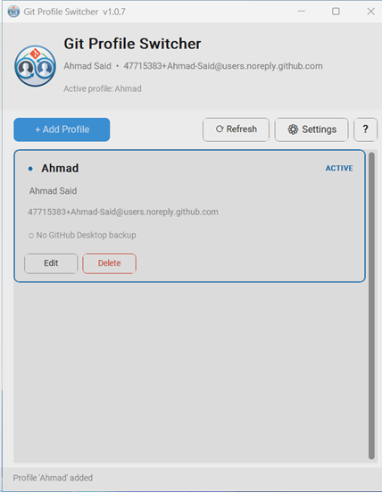
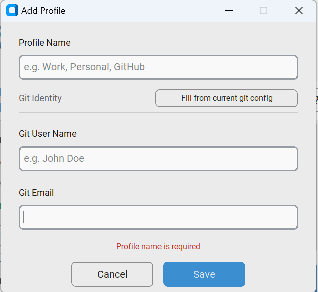
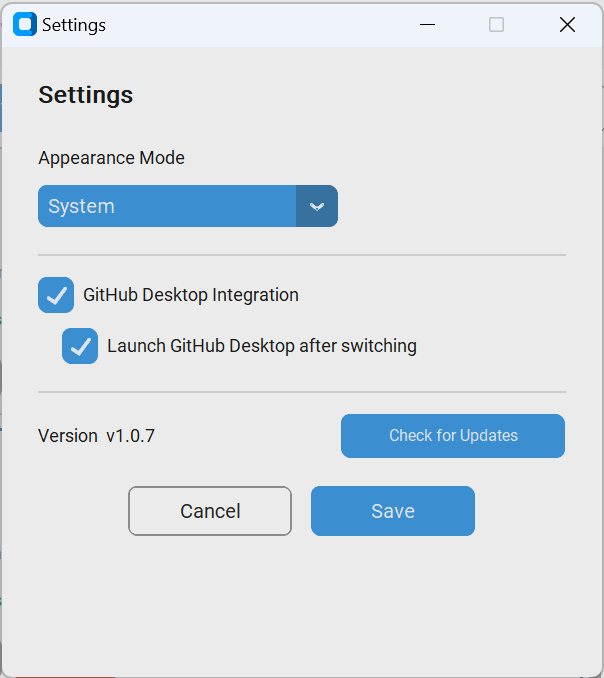

# Git Profile Switcher

> Switch between multiple git identities and GitHub Desktop workspaces with a single click — no terminal required.

[](https://github.com/Ahmad-Said/git_switcher/releases/latest)
[](https://github.com/Ahmad-Said/git_switcher)

---

## Screenshots

|                  Main window                   |                      Add profile                      |                    Settings                    |
|:----------------------------------------------:|:-----------------------------------------------------:|:----------------------------------------------:|
|  |  |  |

---

## Install — one command, no admin required

Open **PowerShell** (Win + R → `powershell`) and run:

```powershell
irm https://raw.githubusercontent.com/Ahmad-Said/git_switcher/main/install.ps1 | iex
```

The installer will:

1. Fetch the latest `.exe` from GitHub Releases
2. Install it to `%LOCALAPPDATA%\GitSwitcher\GitSwitcher.exe`
3. Register it in the user App Paths registry key (no admin needed)
4. Create a **Start Menu** shortcut
5. Offer a **Desktop** shortcut (prompted interactively)

Run the same command again at any time to update to the latest version.

> **Tip:** If you see a script-execution error, run this once first:
> ```powershell
> Set-ExecutionPolicy RemoteSigned -Scope CurrentUser
> ```

---

## Features

- **Profile cards** — each profile stores a git identity (`user.name` + `user.email`) and an optional GitHub Desktop
  workspace backup
- **One-click switching** — kills GitHub Desktop, swaps configs, restores the target workspace, and relaunches the app
- **Git-only mode** — profiles without a GitHub Desktop backup still switch the global git identity
- **Fill from current config** — pre-fills name and email when adding a new profile
- **Self-update** — check for updates from the Settings dialog; the new exe replaces itself without a separate installer
- **Appearance modes** — System, Light, or Dark (via customtkinter)

---

## How switching works

When you click a profile:

1. Running GitHub Desktop process is terminated
2. Current `%APPDATA%\GitHub Desktop` folder is backed up under the active profile's name
3. `git config --global user.name` and `user.email` are updated
4. The target profile's previously backed-up folder is restored
5. GitHub Desktop is relaunched

On the very first switch away from a profile, the backup is created automatically.

---

## First-time setup

### Option A — migrate from existing profiles

For each git identity you already use, click **+ Add Profile** and enter the matching name and email.  
Then switch *to* each profile once while GitHub Desktop is closed — the app will create the backup for that profile
automatically.

### Option B — fresh setup

1. Open GitHub Desktop and sign in with the account for the new profile.
2. In Git Profile Switcher, click **+ Add Profile** and enter the matching git name and email.
3. Close GitHub Desktop.
4. Switch to any other profile — the app backs up the current folder before switching.

---

## Requirements

- Windows 10 or 11
- GitHub Desktop installed at the default location *(optional — only needed for workspace switching)*
- Python 3.10+ *(only required to run from source or build the exe)*

---

## Running from source

```bash
# 1. Create and activate a virtual environment
python -m venv .venv
.venv\Scripts\activate

# 2. Install dependencies
pip install -r requirements.txt

# 3. Launch
python main.py
```

---

## Building a standalone executable

```bash
pip install pyinstaller
pyinstaller build.spec
```

Output: `dist\GitSwitcher.exe` — no Python installation required on the target machine.

---

## Project structure

```
git_switcher/
├── main.py                   # Entry point; also dispatches --apply-update mode
├── install.ps1               # One-command user installer (no admin required)
├── requirements.txt
├── build.spec                # PyInstaller spec (single file, no console)
│
├── core/
│   ├── config.py             # Profile & AppSettings dataclasses, JSON persistence
│   ├── git_manager.py        # Read / write global git config
│   ├── github_desktop.py     # Kill, backup, restore, and launch GitHub Desktop
│   ├── switcher.py           # Switch orchestration with progress callbacks
│   └── updater.py            # Self-update: download, apply, and cleanup
│
├── ui/
│   ├── app.py                # Main window (customtkinter)
│   ├── profile_card.py       # Per-profile card widget
│   ├── profile_dialog.py     # Add / edit profile dialog
│   ├── settings_dialog.py    # Appearance & integration settings
│   └── update_dialog.py      # Check-for-updates dialog
│
├── docs/
│   └── screenshots/          # README screenshots
│
└── utils/
    └── paths.py              # Windows path helpers (%APPDATA%, %LOCALAPPDATA%)
```

---

## Self-update mechanism

Updates are applied without a separate installer:

1. The new `.exe` is downloaded and launched with a hidden `--apply-update` flag.
2. It waits (via Win32 `OpenProcess`) for the running app to exit cleanly.
3. It atomically replaces the installed exe — with retries for AV / file-lock tolerance.
4. It relaunches the freshly installed exe.

If anything goes wrong, a diagnostic log is written to `%TEMP%\GitSwitcher_update.log`.

---

## Configuration

Profiles and settings are stored at:

```
%APPDATA%\GitSwitcher\profiles.json
```

GitHub Desktop workspace backups live alongside the active folder:

```
%APPDATA%\GitHub Desktop          ← active workspace
%APPDATA%\GitHub Desktop-Work     ← backup for "Work" profile
%APPDATA%\GitHub Desktop-Personal ← backup for "Personal" profile
```

---

## Dependencies

| Package                                                         | Version  | Purpose                         |
|-----------------------------------------------------------------|----------|---------------------------------|
| [customtkinter](https://github.com/TomSchimansky/CustomTkinter) | ≥ 5.2.0  | Modern Tk UI widgets            |
| [Pillow](https://python-pillow.org)                             | ≥ 10.0.0 | Image support for customtkinter |
| [pyinstaller](https://pyinstaller.org)                          | ≥ 6.0.0  | Build standalone `.exe`         |
